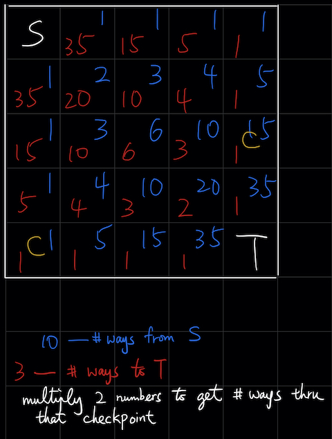

# Class 1
## Slack
- Slack is our communication channel
- All course materials will be distributed there
- You need to log on to slack before and during our weekly class

## Coding in replit.com
1. Register an account
2. Join the twgss Repl project
3. Hello world program:
```
#include <iostream>
using namespace std;

int main() {
    cout << "Hello World!" << endl;
}
```
4. Create your own Repl that prints your own name and invite me (id: haye) into it. [video](http://miyagiacademy.com/public/first-repl.mp4)

## A simple program that counts the occurrences of 'H'
```
#include <iostream>
using namespace std;

int main() {
    string names;
    char letter;
    int i, count;
    names = "CHEN BAI AN HUI KA WAI WAN WING TSANG CHAN PAK HANK LAM CHEUK YIN CHUNG HSIN YU FOK WAI CHUNG LAU YUET CHING LEE HIU TUNG";
    count = 0;
    for (i=0; i<names.size(); i+=1) {
        if (names[i] == 'H') {
            count += 1;
        }
    }
    cout << count << endl;
    return 0;
}
```
1. Every variable need to be declared before you can use it.
2. `string` is an object for storing a *string*.
3. All variables in this program are *local* variables as opposed to *global* variables
4. You can *initialize* a variable when you're declaring it.
5. A for loop in C++ looks like this:
```
for (i=0; i<10; i+=1) {
    [do something...]
}
```
6. `cout` prints the output.
7. Every C++ program starts and finish with the `main()` function. It expects you to return an integer so it's good to `return 0`.

---

## Heat Event Revision
### Section B Question F


### Section A Question 9
1. Charlie gets full marks => happy
2. Charlie feels happy AND raining outside => he plays games at home

- Charlie is not playing games at home => ?
- By (2), we know Charlie is either not happy or it's not raining outside
- We actually don't know enough to say any of the A, B or C. So the answer is D

### Section A Question 12
1. W beats X
2. Y beats W
3. Z beats W
4. Y beats X
5. X beats Z
6. Z beats Y

In the final match,

i. W cannot beat Z (from 3)<br>
ii. Y can beat X (from 4), but can you construct the playoff history?<br>
iii. Sure Y can beat W (from 2), but can you construct the playoff history?

It is only possible to construct the pre-final matches for (ii).

[Question Paper](https://assets.hkoi.org/ref/2018hj.pdf) - [Answers](https://assets.hkoi.org/ref/2018hj_sol.pdf)
